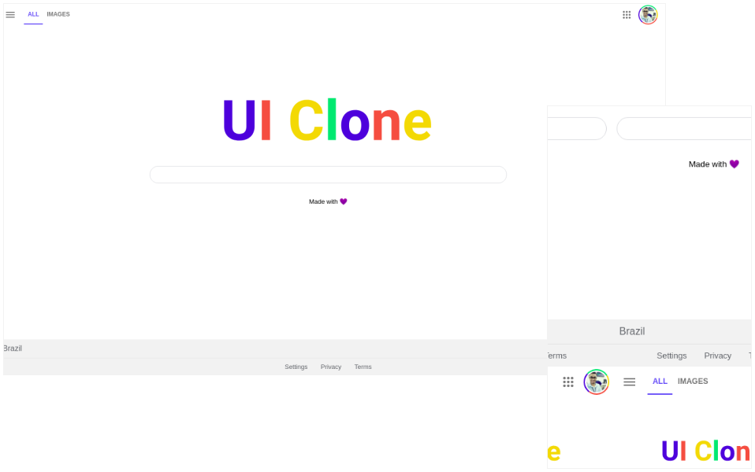

<h1 align="center">
    
</h1>

 

  

## 🚀 Tecnologias

Esse UI Clone foi desenvolvido com as seguintes tecnologias:

- HTML
- CSS

## 💻 UI Clone

O Google UI Clone é um simples experimento para treinar tecnologias como HTML e CSS, além de uma metodologia chamada BEM CSS no qual consiste em organizar classes CSS em blocos, elementos e modificadores 💜
